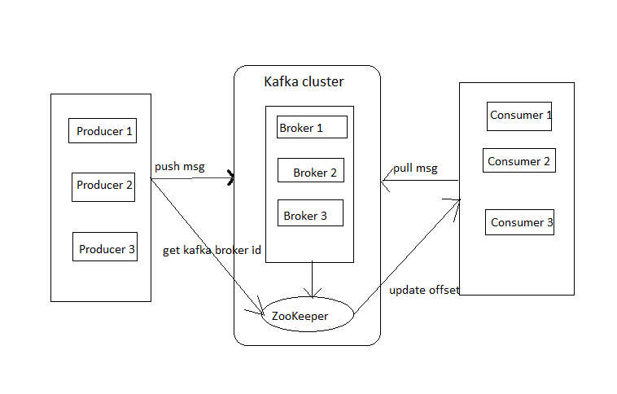

# Apache Kafka Tutorial & Sample Projects

## Overview
Kafka was first developed at LinkedIn and later became an open sourced Apcache project in 2011.
Apache Kafka is publish-subsribe based fault tolerant messaging system. It is fast, scalable and distributed by design.

## Prerequisites
you must have a godd understanding of Java, distributed messaging system and Linux Environment

## Messaging System
- in big data, there a two main challenges. The first challenge is how to collect large volume of data and the second challenge is to analyze the collected data. To overcome those challenges, you must need a messaging system.
- A messaging system is reponsible for tranfering data from one application to another one, so application can focus on daza, but not worry about how to share it.

## Pulish-Subscribe messaging system
- messages are persisted in a topic
- consumers (subscriber) can subscribe one or more topic and consume all the messages in that topic

## What is Kafka
- Apache Kafka is a distributed publish-subsribe messaging system
- robust queue that can handle a high valume of data and suitable for both offline and online messages
- Kafka message a persisted on the disk and replicated within the cluster to prevent data loss
- built on top of Zookeeper synchronization service

## Use Cases of Kafka
- metrcis
- log aggregation
- stream processing

## Kafka Architecture

1. Broker: multiple brokers to maintain load balance. Kafka brokers are stateless, so they use ZooKeeper to maintin their cluster state.
2. ZooKepper: is used to manage and coordinate Kafka broker
3. Producers: publish data to broker
4. Consumers pull data and must know a particular message offset

## Installation steps

Note: Kafka is not intended to be run on Windows natively and has several issues that may arise over time.

Therefore, it is recommended to run Apache Kafka on Windows through:
    If using Windows 10 or above: WSL2 (Windows Subsystem for Linux 2) or Docker
    If using Windows 8 or below: Docker

- For Windows: https://www.conduktor.io/kafka/how-to-install-apache-kafka-on-windows/
- For Linux: https://www.conduktor.io/kafka/how-to-install-apache-kafka-on-linux/

### How to install Kafka with Zookeeper on Windows
    1. You must have Windows 10 or above
	
    2. Install WSL2
	wsl --install -d Ubuntu
	
    3. Install Java JDK version 11
	sudo apt-get install openjdk-11-jdk
	
    4. Download Apache Kafka from https://kafka.apache.org/downloads under Binary
	
    5. Downloads & Extract the contents on WSL2
	
    6. Start Zookeeper using the binaries in WSL2
	bin/zookeeper-server-start.sh config/zookeeper.properties
	
    7. Start Kafka using the binaries in another process in WSL2
	bin/kafka-server-start.sh config/server.properties
	
    8. Setup the $PATH environment variables for easy access to the Kafka binaries
	PATH="$PATH:~/kafka_2.13-3.5.1/bin"
	the conmmand: kafka-tocpics.sh should from any folder
	
	9. to avoid shoutdown wiht log file problem:
	- change in server.properties file: log.dirs=log/kafka-logs
	- change in zookeeper.properties file: dataDir=log/zookeeper

## Kafka CLI
- create a topic:<br/>
bin/kafka-topics.sh --create --topic quickstart-events --bootstrap-server localhost:9092

- view topic:<br/>
bin/kafka-topics.sh --describe --topic quickstart-events --bootstrap-server localhost:9092

- write events/ Msg to topic<br/>
bin/kafka-console-producer.sh --topic quickstart-events --bootstrap-server localhost:9092
 > my frist msg
 > my second msg
 
- read event from queue<br/>
bin/kafka-console-consumer.sh --topic quickstart-events --from-beginning --bootstrap-server localhost:9092
- with partition and offset:<br/>
kafka-console-consumer.bat --topic quickstart-events --bootstrap-server localhost:9092 --partition 0  --offset 2

## Simple Producer & Consumer Example

1. Start Zookeeper server: bin/zookeeper-server-start.sh config/zookeeper.properties
2. Start Kafka server: bin/kafka-server-start.sh config/server.properties
3. Run SimpleProducer.java from SimpleKafkaExample to push msg to the topic 'hello-kafka'
4. Run SimpleSuncomer.java from SimpleKafkaExample to subcribe msg of the topic 'hello-kafka'

## Advanced Kafka Consumer
1. Rebalance Listener <br/>
 - One common use is saving offsets in a custom store. By saving offsets in the onPartitionsRevoked(Collection) call we can ensure that any time partition assignment changes the offset gets saved.
 - start SimpleProducer
 - start ConsumerRebalanceDemo
 
2. Seek and Assign
 - In case you are looking to read specific messages from specific partitions, the .seek() and .assign() API may help you. 
 - remove groud.id
 - remove subscribe()

3. Consumer in Thread
 - Running a Java Consumer in a separate thread allows you to perform other tasks in the main thread. 
## Integration of Kafka into Spring Boot


- 

## Cloning the repository

Please use the following command:

```bash
git clone https://github.com/minhducngo85/Kafka.git
```

## Credits
https://www.conduktor.io/kafka/kafka-topics-advanced/
